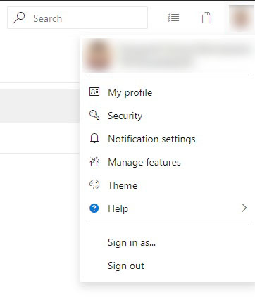
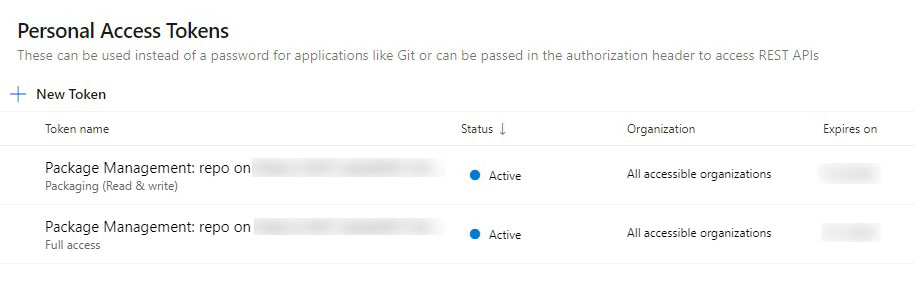

# Setting Maven up to work with Azure DevOps Artifacts

While setting up my Maven, I encountered several problems and found no solution on the Internet. So here is my quick guide on how to set up your Maven to work with Azure DevOps Artifacts. 😊

**Table of contents**
 * [General settings](#general-settings)
 * [Fixing errors](#fixing-errors)
   + [401 Unauthorized](#401-unauthorized)
   + [403 Forbidden](#403-forbidden)
   + [500 Internal Server Error](#500-internal-server-error)

## General settings

To successfully connect to the Azure DevOps project, you need to:
1. Go to **Artifacts** menu (on the left)
2. Click **Connect to feed**
3. Click **Maven** 


4. Click **Generate Maven Credentials** and save it somewhere
5. Copy credentials to `settings.xml` as it's said in the window
6. Copy repository settings to `pom.xml` (both into `<repositories>` and `<distributionManagement>`)

`settings.xml` should look like this:
```XML
...
<servers>
    <server>
        <id>repo_id</id>
        <username>repo_name</username>
        <password>repo_token</password>
    </server>
</servers>
...
```
And `pom.xml` like this:
```XML
<?xml version="1.0" encoding="UTF-8"?>
<project xmlns="http://maven.apache.org/POM/4.0.0"
         xmlns:xsi="http://www.w3.org/2001/XMLSchema-instance"
         xsi:schemaLocation="http://maven.apache.org/POM/4.0.0 http://maven.apache.org/xsd/maven-4.0.0.xsd">
    <modelVersion>4.0.0</modelVersion>
    <packaging>jar</packaging>
    <groupId>groupId</groupId>
    <artifactId>artifactId</artifactId>
    <version>version</version>
    <repositories>
        <repository>
            <id>repo_id</id>
            <url>repo_url</url>
            <releases>
                <enabled>true</enabled>
            </releases>
            <snapshots>
                <enabled>true</enabled>
            </snapshots>
        </repository>
    </repositories>
    <distributionManagement>
        <repository>
            <id>repo_id</id>
            <name>repo_name</name>
            <url>repo_url</url>
        </repository>
    </distributionManagement>
    <properties>
        <project.build.sourceEncoding>UTF-8</project.build.sourceEncoding>
    </properties>
</project>
```

## Fixing errors

Here is all error that I encountered.

### 401 Unauthorized

It usually occurs when repo `id` in `pom.xml` and `settings.xml` mismatch or `url` is not `https`, so check it first.
The second reason is when you created a token and didn't give it enough permissions for deployment. To fix it, go to your profile:



Then click **Security**:



Choose your **token** and try to give it all neccessary permissions (write & read).

### 403 Forbidden

403 error means as we all know, that we have no access to a remote repo. So it's likely your proxy is blocking the connection, or your SSL certificate that is used in Java is outdated. The proxy problem could be fixed by excluding Azure DevOps URL from proxy in `settings.xml`, mostly when Azure DevOps is located inside your company network, so you don't need a proxy:
```XML
<proxies>
    <proxy>
        ...
        <nonProxyHosts>
            azuredevops.myorg.com
        </nonProxyHosts>
    </proxy>
<proxy>
```

### 500 Internal Server Error

If your Azure DevOps has no access to Maven repositories, go to `Artifacts` -> `Feed settings` -> `Upstream sources` and delete Maven from the list.


