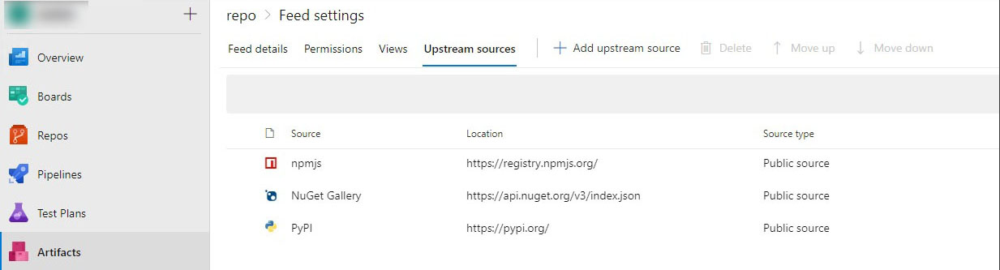

# Setting Maven up to work with Azure DevOps

To successfully connect to Azure DevOps project you need to:
1. Go to **Artifacts** menu


2. Click **Connect to feed**
3. Click **Maven** 


4. Generate Maven Credentials
5. Copy credentials to `settings.xml`
6. Copy repository settings to `pom.xml` (insert it into `<repositories>` and `<distributionManagement>`)

`settings.xml`:
```XML
...
<servers>
    <server>
        <id>repo_id</id>
        <username>repo_name</username>
        <password>repo_token</password>
    </server>
</servers>
...
```
`pom.xml`:
```XML
<?xml version="1.0" encoding="UTF-8"?>
<project xmlns="http://maven.apache.org/POM/4.0.0"
         xmlns:xsi="http://www.w3.org/2001/XMLSchema-instance"
         xsi:schemaLocation="http://maven.apache.org/POM/4.0.0 http://maven.apache.org/xsd/maven-4.0.0.xsd">
    <modelVersion>4.0.0</modelVersion>
    <packaging>jar</packaging>
    <groupId>groupId</groupId>
    <artifactId>artifactId</artifactId>
    <version>version</version>
    <repositories>
        <repository>
            <id>repo_id</id>
            <url>repo_url</url>
            <releases>
                <enabled>true</enabled>
            </releases>
            <snapshots>
                <enabled>true</enabled>
            </snapshots>
        </repository>
    </repositories>
    <distributionManagement>
        <repository>
            <id>repo_id</id>
            <name>repo_name</name>
            <url>repo_url</url>
        </repository>
    </distributionManagement>
    <properties>
        <project.build.sourceEncoding>UTF-8</project.build.sourceEncoding>
    </properties>
</project>
```

## Fixing errors

### 403 Forbidden

It could be fixed by excluding Azure DevOps URL from proxy in `settings.xml`:
```XML
<proxies>
    <proxy>
        ...
        <nonProxyHosts>
            azuredevops.myorg.com
        </nonProxyHosts>
    </proxy>
<proxy>
```

### 401 Unauthorized

Check if `pom.xml` and `settings.xml` has the same `id` and `url` uses `https`. 
If the error is still present go to your **Profile**:


Click **Security**:


Choose your **token** and set it to Full Access or make custom settings:


### 500 Internal Server Error

If your Azure DevOps has no access to Maven repositories, just go to `Artifacts` -> `Feed settings` -> `Upstream sources` and delete Maven from list.


